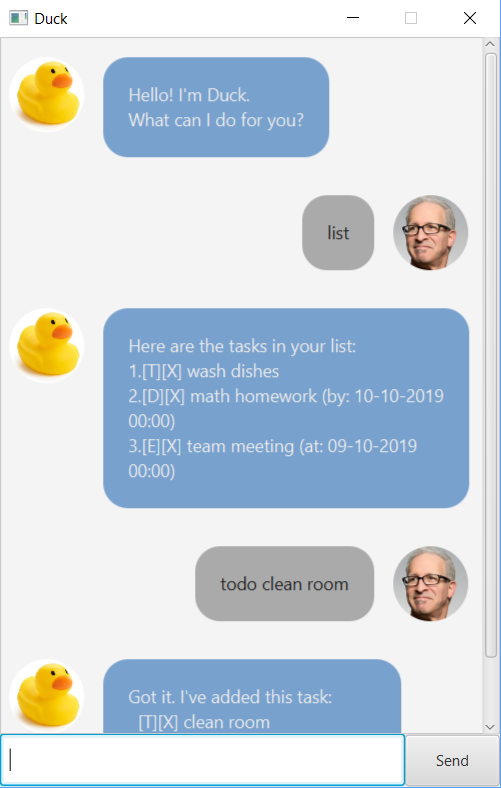
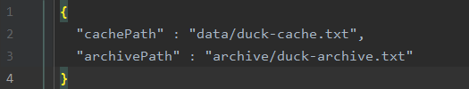

# User Guide

Duck is a portable lightweight task manager. You can manage your tasks in Duck using only
a command line, without any need for complex GUI interfaces.

## Features 

- [Simple and intuitive user interface](#simple-and-intuitive-user-interface)
- [Manages multiple types of tasks](#manages-multiple-types-of-tasks)
- [Saves your updates automatically](#saves-your-updates-automatically)
- [Archives your tasks](#archives-your-tasks)

### Simple and intuitive user interface 

Interacting with Duke is just like interacting with one of your friends on social media.
To issue a command, simply type it in the command bar and press 'Enter' (or click the 'Send' button).

### Manages multiple types of tasks

Duck isn't limited to a single type of task. Duck can manage to-dos, deadlines and events all at the same time!

### Saves your updates automatically

Duck saves each of your updates automatically in a file defined by default to be at `data/duck-cache.txt`.
If you don't like the location, don't worry! Open up `duck-config.txt` in your preferred editor, and you will see
a file like below:

Change `data/duck-cache.txt` to your preferred storageHandler location, and Duck will know to save your tasks there
next time you run Duck.

### Archives your tasks

If you hate to see a cluttered list, Duck can archive specific tasks by deleting them from your tasks list
and saving them to an archive file. This archive file is by default at `archive/duck-archive.txt`, but you can also
change this at `duke-config.txt`.

## Usage

### `todo/deadline/event`

Adds a new task to your task list.

<strong>Command Format</strong>

`todo [description]`  
`deadline [description] /by [time]`  
`event [description] /at [time]`  

<strong>Usage examples</strong>

`todo wash dishes`

Adds a new to-do with description `wash dishes`.

`deadline math homework /by 10-10-2019`

Adds a new deadline with description `math homework` by time `10-10-2019`.

`event team meeting /at 13-10-2019`

Adds a new event with description `team meeting` at time `13-10-2019`.

***

### `list`

Lists all tasks currently in your list.

<strong>Command Format</strong>

`list`  

***

### `done`

Marks a task in your list as done.

<strong>Command Format</strong>

`done [index]`  

<strong>Usage examples</strong>

`done 1`

Marks the first task in your list as done.

***

### `delete`

Deletes a task in your list. This task will not be saved and is lost forever.

<strong>Command Format</strong>

`delete [index]`  

<strong>Usage examples</strong>

`delete 1`

Deletes the first task in your list.

***

### `find`

Finds all tasks in your list whose description contains a search string.

<strong>Command Format</strong>

`find [string]`  

<strong>Usage examples</strong>

`find project`

Finds all tasks in your list whose description contains the string
`project`, and displays them in a list.

***

### `archive`

Archives some tasks in your list. These tasks are deleted from your task list
and saved in the archive file.

<strong>Command Format</strong>

`archive [index1] [index2] ...`  
`archive *`  
`archive all`

<strong>Usage examples</strong>

`archive 1 3 4`

Archives the 1st, 3rd and 4th task in your list.

`archive *`

Archives all the tasks in your list. In other words, it transfers your task list to the archive file.

***

### `bye`

Exits the Duck interface.

<strong>Command Format</strong>

`bye`